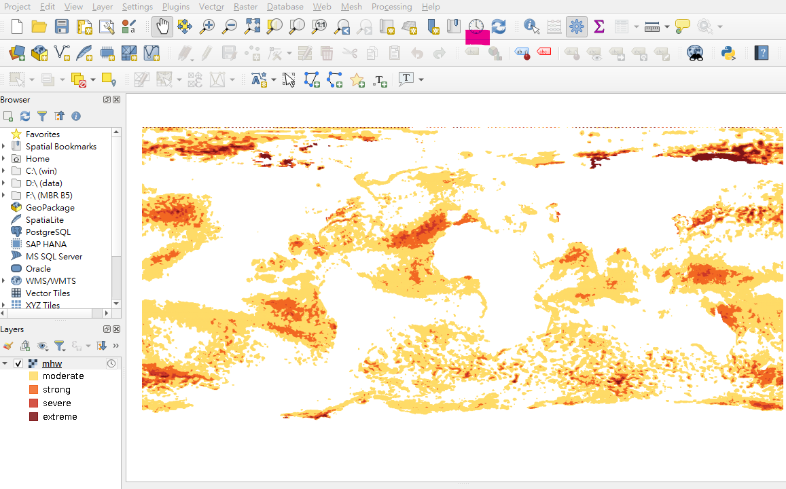

# QGIS tutorial 01
## 利用 QGIS 加入 ODB 海洋熱浪 (Marine Heatwave, MHW) WMS 圖層

* 必要： [下載並安裝 QGIS](https://qgis.org/zh-Hant/site/forusers/download.html)、學習 [QGIS 基礎使用](https://www.qgistutorials.com/zh_TW/)
* 選擇性套件：安裝 QGIS 後開啟 QGIS，可為接下來的 MHW WMS 圖層添加底圖，其中較為簡便的方式：請參考安裝 [QuickMapServices Plugin](https://opengislab.com/blog/2018/4/15/add-basemaps-in-qgis-30)

**操作功能表單，加入 MHW WMS**

1. 功能表單【Layer】->【Add Layer】->【Add WMS/WMTS Layer】，跳出對話框
 

2. 若是第一次操作，尚未加入 ODB WMS server，於對話框按【New】，跳出子對話框，可在此填入 ODB WMS server URL

    - 【Name】：任意為此 Connection 取名，如 ODB_marineheatwave
    - 【URL】：填入 https://ecodata.odb.ntu.edu.tw/geoserver/marineheatwave/wms
    - 填完後按【確定】離開子對話框，回到上一層對話框

 

3. 此時已可在上一層對話框中看到剛才填入的 Connection: ODB_marineheatwave，按【Connect】

    - Note! 可能需要等待 30 seconds - 1 minutes 與 ODB WMS server 連接，取得圖層資訊
    - 若連結成功，取得圖層資訊，可找到 mhw: Gridded (0.25 degree) Marine Heatwave 於圖層表列中，點選它 (mhw) 後按【Add】->【關閉】
    - Note! 此時可能需要再等待 2 minutes - 5 minutes，讓 QGIS 從 ODB WMS server download > 40 years MHW 資料

 

4. 若圖層下載成功，可在QGIS 看到最新月份的海洋熱浪 WMS 圖層，左下圖層框會有圖層圖例，區分海洋熱浪從 moderate -> extreme為四級

 

5. 若要調整 MHW 出現的時間，請選擇功能表單下的時鐘圖示（clock icon: Temporal Controller Panel），按下後會出現時間控制儀表板

    - 在時間控制儀表板 Temporal Controller Panel 按右三角形按鈕（right-triangle icon: animated temporal navigation）可調整 MHW 時間

 

6. 可以為 ODB MHW WMS layer 加上喜歡的底圖，疊圖後讓海洋熱浪發生的位置更為清楚！

    - 請參考上述選擇性套件：QuickMapServices Plugin 即可簡易選擇底圖

**Contact Us**

   * [ODB website - About Us](https://www.odb.ntu.edu.tw/about-us): yehtc@ntu.edu.tw or cyweng24@ntu.edu.tw
 
